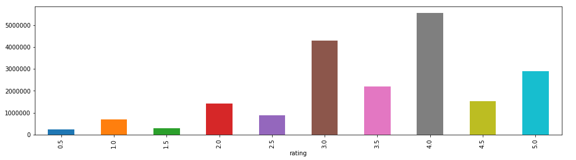
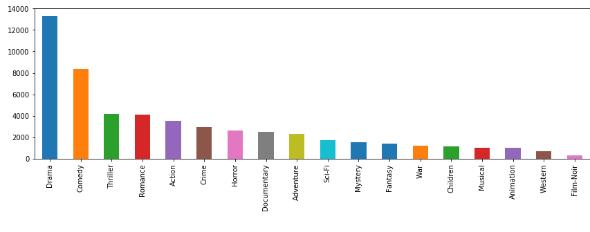

# Práctico de Aprendizaje no supervisado

## Tarea

Obtener reglas de asociación entre películas en el dataset movielens (como si fuera recomendación!) (ah! Pero recomendación es no supervisado?).  
Aplicar diferentes métricas de ordenamiento.  
Hacer un pequeño informe (entre 200 y 500 palabras): https://rpubs.com/vitidN/203264  


## Solucion

Se hizo una exploración de datos en un _notebook_ que puede verse [aquí](https://github.com/avdata99/diplo-datos-materia5-aprendizaje-no-supervisado/blob/master/practico/movies.ipynb).

### Algunos detalles

Hay más de 27.000 películas y 20.000.000 de calificaciones de 138.000 usuarios.


Se definen a las transacciones como la lista de películas que cada usuario valoro con 5 puntos. De esta forma pasamos de una lista de 20.000.000 de calificaciones a una de menos de 3.000.000.  


Como el procesamiento requerido excede el de la computadora local se uso un equipo de CCAD. Para eso se genero un script en python al que vía parámetros se le pueden indicar:
 - el soporte mínimo
 - la minima confianza
 - el mínimo _lift_ aceptado
 - el directorio donde estan los datos (en cada entorno es distinto)
 - la cantidad de transacciones a procesar. El total a procesar son más de 20.000.000 y es muy util probar solo con algunas miles de ellas para no tener que esperar tanto entre cada iteracion

Ejemplo:

```
# en mi equipo local
python3 movies.py \
    --truncate_transactions=30000 \
    --min_support=0.001 \
    --min_confidence=0.7 \
    --min_lift=4 \
    --data_folder=/data/DiploDatos-aprendizaje-no-supervizado/ml-20m

# en el equipo del CCAD
python3 movies.py \
    --min_support=0.001 \
    --min_confidence=0.7 \
    --min_lift=4 \
    --data_folder=ml-20m
```


## Generos

Se hizo además una análisis exploratorio de generos que finalmente no se uso para las recomendaciones.  
