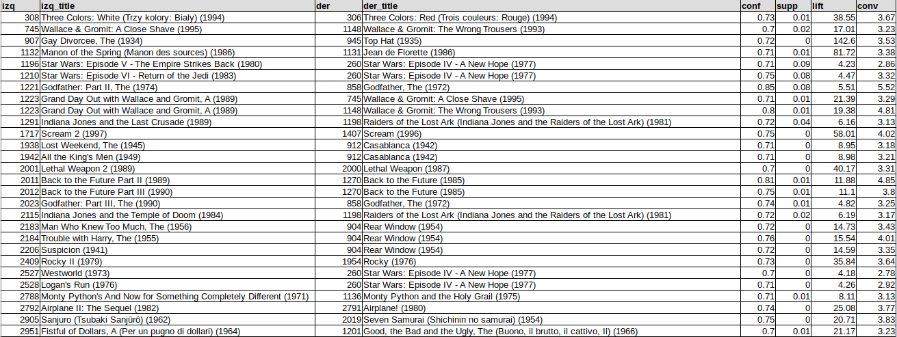

# Práctico de Aprendizaje no supervisado

## Tarea

Obtener reglas de asociación entre películas en el dataset movielens (como si fuera recomendación!) (ah! Pero recomendación es no supervisado?).  
Aplicar diferentes métricas de ordenamiento.  
Hacer un pequeño informe (entre 200 y 500 palabras): https://rpubs.com/vitidN/203264  


## Solucion

Se hizo una exploración de datos en un _notebook_ que puede verse [aquí](movies.ipynb) pero el trabajo definitivo se hizo con [un script](movies.py) que corrio en un equipo del CCAD. Este script permite definir parámetros desde la línea de comandos de modo de definir y probar de forma rápida diferentes combinaciones de _support_, _confidence_ y otros nuevos parámetros definidos.  

### Algunos detalles

Hay más de 27.000 películas y 20.000.000 de calificaciones de 138.000 usuarios.


Se definen a las transacciones como la lista de películas que cada usuario valoro con 5 puntos. De esta forma pasamos de una lista de 20.000.000 de calificaciones a una de menos de 3.000.000 (Y DE 16.500.000 con ratings de hasta 3). Con más capacidad de cómputo esto podría ampiarse (solo deberá usarse el parámetro _min_rating_ en el script entregado seteado en 4 o 3 por ejemplo).  

Como el procesamiento requerido excede el de la computadora local se uso un equipo de CCAD. Para eso se genero [un script](movies.py) en python al que vía parámetros se le pueden indicar:
 - el soporte mínimo
 - la minima confianza
 - el mínimo _lift_ aceptado
 - la calificación mínima para que se considere que un usuario recomienda una película (se probo con solo los cincos y una más extendida desde los tres en adelante)
 - el directorio donde estan los datos (en cada entorno es distinto)
 - la cantidad de transacciones a procesar. El total a procesar son más de 20.000.000 y es muy util probar solo con algunas miles de ellas para no tener que esperar tanto entre cada iteracion

Ejemplo:

```
# en mi equipo local limito solo los primeros 100 ratings de 5 estrellas
# y luego solo las primeras 1.000 transacciones generadas: 
python3 movies.py \
    --truncate_transactions=1000 \
    --min_support=0.001 \
    --min_confidence=0.7 \
    --min_lift=4 \
    --data_folder=/data/DiploDatos-aprendizaje-no-supervizado/ml-20m \
    --max_length=2 \
    --min_rating=5 \
    --truncate_ratings=100

# en el equipo del CCAD
python3 movies.py \
    --min_support=0.001 \
    --min_confidence=0.7 \
    --min_lift=4 \
    --min_rating=3 \
    --data_folder=ml-20m
# procesa 131.839 transacciones
```

### Resultados

Este script graba un archivo CSV con recomendaciones posibles para las películas sobre las cuales podemos recomendar. De manera simple y dado el ID de alguna película podríamos listar por nivel de confianza y _lift_ usa serie de películas recomendadas.  



### Mejoras posibles

Debido a los lento de este proceso el argumento _max_length_ se uso siempre en 2. Esto solo permite analizar las peliculas individualmente y no en grupos. Con más caṕacidad de cómputo sumplemente debe pasarse a 4 (por ejmplo) para generar recomendaciones mas complejas.

## Tiempos
Localmente siempre con `--min_support=0.001`, `--min_confidence=0.7`, `--min_lift=4` `--truncate_transactions=1000`, `--max_length=2` y `--truncate_ratings=1000`
Esto genera solo 52 transacciones y los tiempos son:
 - 54 segundos con `--max_length=2`
 - Con `--max_length=3` lo suspendí despues de una hora de procesamiento.

En el CCAD y corriendo con la única limitacion `--max_length=2`
 - y `--min_rating=5` se analizan 131.839 transacciones en un tiempo total fue de 6.2 horas y genero [55 reglas](rules-sup0.001-conf0.7-length2-rating5.csv).
 - además con `--min_rating=3` se analizaron 138.445 transacciones en un tiempo total de X horas y generó [XX reglas](rules-sup0.001-conf0.7-length2-rating3.csv)


## Generos

Se hizo además una análisis exploratorio de generos que finalmente no se uso para las recomendaciones.  

